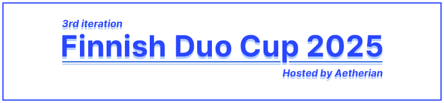

---
tags:
  - FDC2025
  - FDC
---

# finnish duo cup 2025

The **finnish duo cup 2025** (**_FDC2025_**) is a 2v2 double-elimination osu!standard tournament hosted by ::{ flag=FI }:: [Aetherian](https://osu.ppy.sh/users/6263040). The tournament requires at least one of the players in each team to be from ::{ flag=FI }:: Finland or ::{ flag=AX }:: Åland. It is the third instalment of the finnish duo cup.

## Tournament schedule

|              Event | Timestamp                         |
| -----------------: | :-------------------------------- |
| Registration phase | 2024-12-12/2024-12-31 (18:00 UTC) |
|         Qualifiers | 2025-01-11/2025-01-12             |
|        Round of 32 | 2025-01-18/2025-01-19             |
|        Round of 16 | 2025-01-25/2025-01-26             |
|      Quarterfinals | 2025-02-01/2025-02-02             |
|         Semifinals | 2025-02-08/2025-02-09             |
|             Finals | 2025-02-15/2025-02-16             |
|       Grand Finals | 2025-02-22/2025-02-23             |

## Prizes

|                          Placing                           | Prize(s)                      |
| :--------------------------------------------------------: | :---------------------------- |
|      | Profile badge, profile banner |
|  | Profile banner                |
|  | Profile banner                |

## Organisation

The finnish duo cup 2025 is run by various community members.

| Position           | Member(s) |
| :----------------- | :-------- |
| Host               |           |
| Mappool selector   |           |
| Mapper             |           |
| Mappool playtester |           |
| Streamer           |           |
| Commentator        |           |
| Designer           |           |
| Referee            |           |

## Links

- **[Information spreadsheet](https://docs.google.com/spreadsheets/d/1cxQhtzad4zdV6etgEOMr5YopK6ZYdEt7WS8to_A40gY/edit?usp=sharing)**
- [Discussion thread](https://osu.ppy.sh/community/forums/topics/2014182?n=1)
- [Livestream]({https://www.twitch.tv/aetherian_tournaments)
- [Challonge bracket](https://challonge.com/fdc2025)
- [Discord server](https://discord.gg/SagCfnzEvM)

## Participants

|     | Team | Members |
| :-: | :--: | :------ |
|     |      |         |
|     |      |

## Podium

This competition has come to an end and resulted in the following podium:

|                          Placing                           | Team                                                                            |
| :--------------------------------------------------------: | :------------------------------------------------------------------------------ |
|      | **oddloop** (::{ flag=FI }:: [Kalanluu](), ::{ flag=PL }:: [MALIZSEWSKI]())     |
|  | **bunny party** (::{ flag=FI }:: [Eevert](), ::{ flag=KR }:: [Amamya Kokoro]()) |
|  | **terence** (::{ flag=FI }:: [house](), ::{ flag=NO }:: [NINERIK]())            |

 <!-- remove image if not available -->

## Mappools

### Stage

**[Download the mappack here! (SIZE)](LINK)**

- ModType
  1. [BeatmapArtist - BeatmapTitle (BeatmapCreator) [BeatmapDifficulty]](BeatmapLink)
- Tiebreaker
  1. **Beatmap**

<!-- tiebreaker beatmaps must be bolded

If the mappool doesn't use a standard ModType pool structure, alternative titles may be used instead. -->

## Match results

### Stage

Day, date: <!-- e.g. Saturday, 17 June 2018: -->

<!-- For solo tournaments, replace table header with: | Player 1 |  |  | Player 2 | Match link | -->

|                       Team 1 |                                                                                 |       | Team 2                       | Match link       |
| ---------------------------: | :-----------------------------------------------------------------------------: | :---: | :--------------------------- | :--------------- |
| **WINNER** ::{ flag=CODE }:: |                                    **SCORE**                                    | SCORE | ::{ flag=CODE }:: LOSER      | [#1](MatchLink)  |
|      LOSER ::{ flag=CODE }:: | -1 <!-- It's convention to write "-1" for forfeits, but this isn't required --> | **0** | ::{ flag=CODE }:: **WINNER** | _win by default_ |
|     TEAM_A ::{ flag=CODE }:: |                                        0                                        |   0   | ::{ flag=CODE }:: TEAM_B     | _nullified_      |

## Ruleset

<!-- organise the ruleset of your tournament here

example header structure:

### General
### Registration
### Stages
### Scheduling
### Mappools
### Match procedure

 -->
